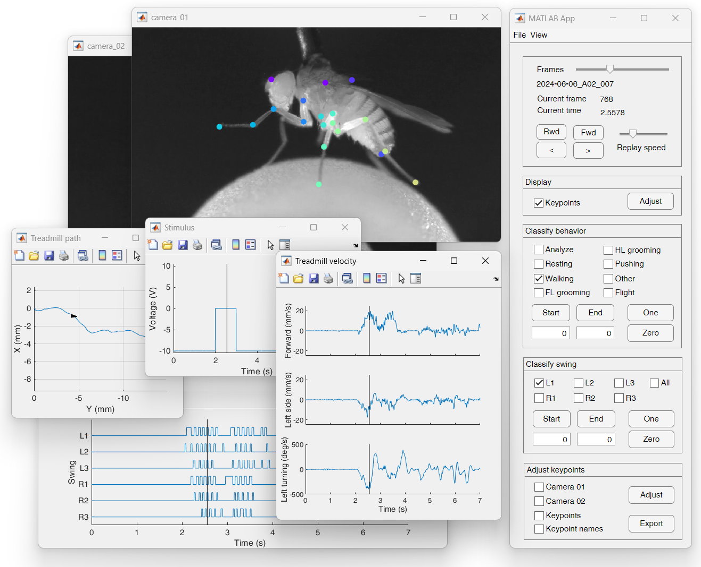

# fly-on-the-ball-analysis-app
MATLAB app for analyzing fly-on-the-ball experiments.

This is work in progress. Currently, users can play recorded behavioral videos and other time series data, manually classify animal behavior, automatically detect swing phases of the legs using LSTM networks, and manually label video keypoints for training a DeepLabCut network. The settings are specified in `config.toml`.   

## Requirements 
The code was tested on Windows 11 with MATLAB R2023a. It requires the packages [matlab-toml](https://www.mathworks.com/matlabcentral/fileexchange/67858-matlab-toml) and [export_fig](https://www.mathworks.com/matlabcentral/fileexchange/23629-export_fig) in the MATLAB path. Using the LSTM networks requires Matlab's Deep Learning Toolbox.